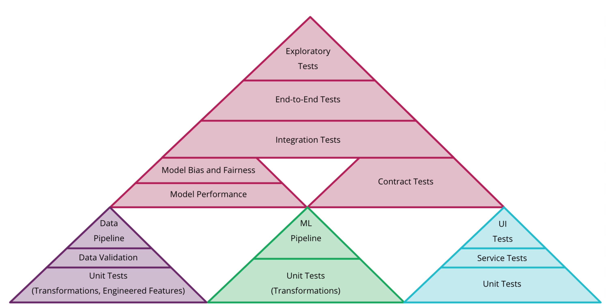

### This repository contains my own self-interpreted takeaways related to Best Practices of (non-) production Machine Learning

-  [Hidden Technical Debt in Machine Learning Systems](https://github.com/MatusChladek/ml-bp/blob/master/ml-debt.md)

- [Rules of Machine Learning: Best Practices for ML Engineering](https://github.com/MatusChladek/ml-bp/blob/master/rules-of-ml.md)

Proposal of combination of tests for each type of artifact (code, model, and data) into single Test Pyramid for ML systems from [Continuous Delivery for Machine Learning](https://martinfowler.com/articles/cd4ml.html)
